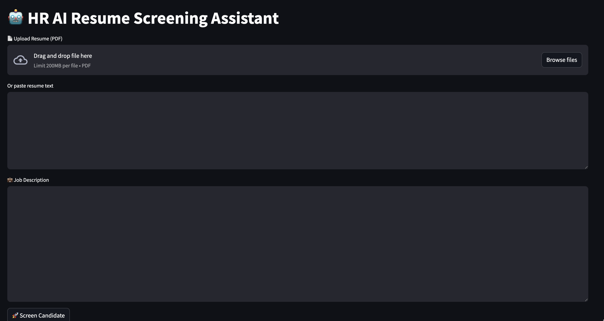
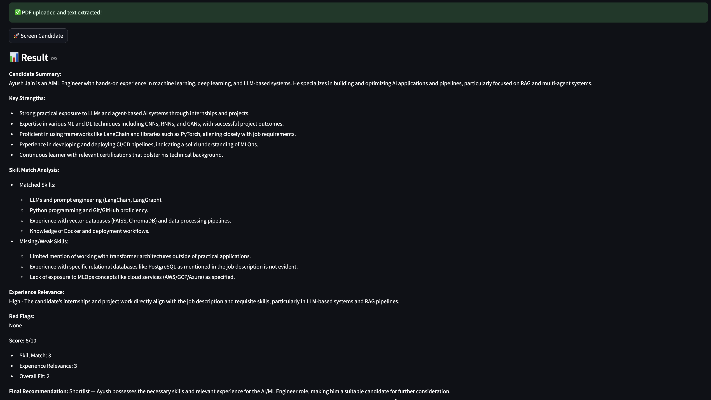

 
  
# 🤖 HR AI Resume Screening Assistant  
An AI-powered application that automates resume screening by comparing candidate resumes with job descriptions using **LangChain + OpenAI LLMs**.  
This tool helps HR teams **reduce manual effort, speed up screening, and make consistent hiring decisions**.  
This tool helps HR teams **reduce manual effort, speed up screening, and make consistent hiring decisions**.  
  
⸻  
  
## 🚀 Features  
* 📄 Upload or paste resume (PDF supported)  
* 💼 Input job description  
* 🧠 AI-based resume analysis using OpenAI  
* ✅ Extracts candidate strengths (3–4 bullet points)  
* 🎯 Matches skills with job requirements  
* 📊 Provides decision: **Shortlist / Reject**  
* 📊 Provides decision: **Shortlist / Reject**  
* ⚡ Interactive UI using Streamlit  
  
⸻  
  
## 🛠️ Tech Stack  
* **LangChain (LCEL)** – Prompt chaining  
* **OpenAI API** – LLM (e.g., GPT models)  
* **Streamlit** – UI  
* **PyPDF2** – PDF parsing  
* **Python** – Backend  
  
⸻  
  
## 📂 Project Structure  
```
HR_AI_Assistant/
│
├── app/
│   ├── models/
│   ├── prompts/
│   ├── services/
│   └── utils/
│
├── st_app.py
└── README.md

```
  
⸻  
  
## ▶️ How to Run Locally  
## 1. Clone Repository  
```
git clone https://github.com/your-username/hr-ai-resume-screening.git
cd hr-ai-resume-screening

```
  
⸻  
  
## 2. Install Dependencies  
```
pip install -r requirements.txt

```
  
⸻  
  
## 3. Set OpenAI API Key  
**Mac / Linux:**  
```
export OPENAI_API_KEY="your_api_key_here"

```
**Windows:**  
```
set OPENAI_API_KEY=your_api_key_here

```
  
⸻  
  
## 4. Run Streamlit App  
```
streamlit run st_app.py

```
  
⸻  

## 🖼️ Application Demo

### 📥 Input Interface



---

### 📤 Output Result



---

## 🧠 How It Works

1. User uploads or pastes resume  
2. User enters job description  
3. Prompt Template formats input  
4. OpenAI LLM processes the data  
5. System returns:
   - Strengths
   - Matching skills
   - Final decision (Shortlist / Reject)

---

## ⚠️ Notes

- Requires OpenAI API key  
- API usage may incur cost  
- Do NOT upload `.env` file to GitHub  

---

## 🔥 Future Improvements

- 📊 Candidate scoring system  
- 📄 OCR for scanned resumes  
- 🌐 Deployment (Streamlit Cloud)  
- 🤖 Multi-agent HR system  

---

## 👨‍💻 Author

**Ayush Jain**  
AI/ML Engineer | NLP | LangChain | Generative AI  

---

## ⭐ Support

If you like this project, give it a ⭐ on GitHub!